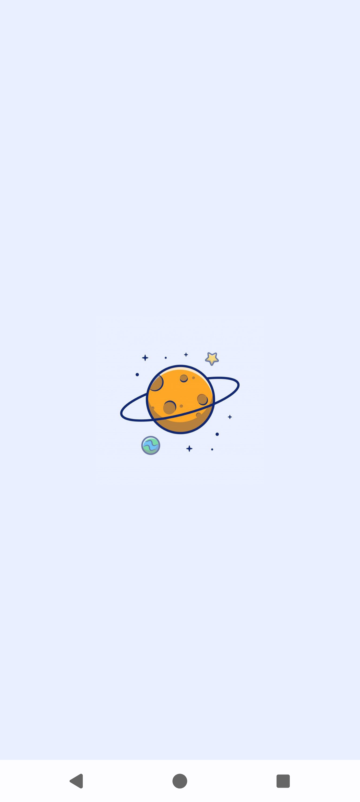

# PlanetsApp

## This app will show list of planets retrieved from SWAPI api with the help of pagination and data will be store locally for offline usage.

### The PlanetsApp consists of 3 pages( Splash, Planets and PlanetsDetails) and after the splash, the user will be redirected to Planets page and Planets will be loaded as user scrolls down and click upon a planet, The user will will redirect to Planet Details page.

### Implementation Summary

* Architecture and Design
  * Followed MVVM/MVI with Repository and ViewModel layers
  * Used Jetpack compose for building declarative UI
  * Paging3 Library is used to load paginated data seamlessly as the user scrolls


* Data layer
  * Retrofit is used to fetch data from the remote API
  * RoomDB is used as the local database for offline data store
  * PlanetRemoteMediator is implemented to sync paginated data between local DB and network
  * To maintain the same image when land on the details page, planetId value in the url data field is used. as per the observation, each planet json object contains an url field and url has a unique id to the particular planet object.


* UI Layer
  * Entire app is built using jetpack compose, leveraging LazyColumn, LazyPagingItem for smooth and efficient data loading and rendering
  * Displays loading state and error state if initial planets loading failed, if the data is available in the DB, cached data will be shown


Technologies used
```agsl
- Jetpack compose
- Hilt
- Retrofit
- Room database
- Paging3
- Coil
```

### Base URL for API and base url for image 

make sure to add base urls for api and image api in gradle.properties. it contains the API_BASE_URL and IMAGE_BASE_URL

```agsl
API_BASE_URL=https://swapi.dev/api/
IMAGE_BASE_URL=https://picsum.photos/id/
```
### Error handling with retry

To test the error handling with retry, turn off the internet and install the application, then launch the app. this will display the error page. then turn on the internet and click retry to load the planets.

if the planets are loaded, turning off the internet will not show the error screen, app will show the already loaded planets.


## Screens

### Splash


### Planets


### Planet Details


### Error page


